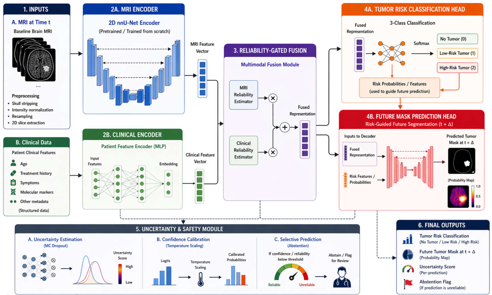
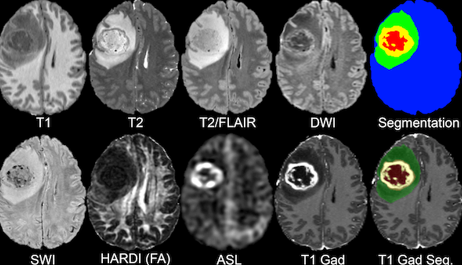

# 🧠 Safe Multimodal Brain Tumor Progression Modeling via Joint Classification and Forecasting from MRI and Clinical Text

**CAP 5516 — Medical Image Computing (UCF)**  
Obinsonne Servius · Darinka Townsend  

---

## 📌 Overview

This project presents a **multimodal framework** for brain tumor analysis from longitudinal MRI, combining:

- **Severity classification**  
- **Future tumor forecasting**

Given a baseline MRI scan and clinical metadata, the model predicts tumor severity and estimates future tumor progression.

---

## Method

### 🔹 Classification
- ViT encoder for MRI
- DistilBERT for clinical text
- Reliability-gated fusion (adaptive modality weighting)
- Monte Carlo Dropout for uncertainty

### 🔹 Forecasting
- Predicts future tumor segmentation masks
- Uses classification output as guidance for progression modeling

<p align="center">
  
</p>

---

## Dataset

We use the  
👉 https://imagingdatasets.ucsf.edu/dataset/2

- 286 patients  
- Multimodal MRI (T1, T1ce, T2, FLAIR)  
- Expert segmentation masks  
- Clinical metadata (IDH, MGMT, ATRX, etc.)

Severity labels:
- Low (Grade 1–2)
- Mid (Grade 3)
- High (Grade 4)

<p align="center">
  
</p>
---

## Results

### 🔹 Classification

| Metric | Score |
|--------|------|
| Accuracy | 0.8192 |
| Macro F1 | 0.7425 |
| AUROC | 0.8395 |
| ECE | 0.1790 |

### 🔹 Forecasting

| Model | Dice | Area Error |
|------|------|------------|
| Image-only | 0.6171 | 743.10 |
| Multimodal | 0.6697 | 654.50 |

<p align="center">
  
</p>
<p align="center">
  
</p>
<p align="center">
  
</p>
<p align="center">
  
</p>
<p align="center">
  
</p>
---

## Setup

Tested with:
- Python 3.11  
- PyTorch 2.5  
- CUDA 12.1  

```bash
python3 -m venv venv
source venv/bin/activate

pip install torch torchvision --index-url https://download.pytorch.org/whl/cu121
pip install numpy timm transformers scikit-learn tqdm matplotlib
```

---

## Preprocessing

```bash
python3 preprocess.py --dataDir /path/to/data --outDir processed/
```

- Extracts tumor-containing slices  
- Builds manifest.csv  
- Removes grade labels to prevent leakage  

---

## Training

```bash
python3 train.py --manifest processed/manifest_clean.csv
```

Recommended:

```bash
python3 train_frozen.py --manifest processed/manifest_clean.csv
```

---

## HPC (UCF Newton)

```bash
srun --account=course_cap5516 \
     --partition=normal \
     --qos=course_cap5516 \
     --gres=gpu:1 \
     --mem=32G \
     --time=8:00:00 \
     --pty bash
```

---

## Key Insights

- Multimodal learning improves both classification and forecasting  
- Clinical features help guide spatial tumor prediction  
- Model shows overfitting → freezing encoders improves generalization  
